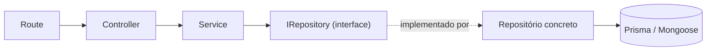

# Arquitetura

| Metadado            | Valor                                                              |
| ------------------- | ------------------------------------------------------------------ |
| Prompt summary      | Documentar a arquitetura do schema base após a reescrita do `src/` |
| Creation date       | 2026-09-01                                                         |
| Change count        | 0                                                                  |
| Last update date    | 2026-09-01                                                         |
| Last prompt summary | Documentar a arquitetura do schema base após a reescrita do `src/` |

Contrato e nomenclatura estão em [`PADROES.md`](PADROES.md); o porquê de cada escolha, e o que ela custa, está em [`DECISOES.md`](DECISOES.md). Este documento cobre camadas, direção de dependência e o que precisa existir para um módulo novo funcionar.

## Visão geral

```
src/
  configs/     configuração e clientes de banco
  shared/      infraestrutura transversal
  modules/     domínio, um diretório por recurso
  server.ts    bootstrap
```

`configs/` fica **fora** de `shared/`. Middlewares ficam em `shared/infra/https/middlewares/` — middleware é infraestrutura HTTP, não utilitário.

## Aliases

| Alias        | Aponta para     |
| ------------ | --------------- |
| `@configs/*` | `src/configs/*` |
| `@shared/*`  | `src/shared/*`  |
| `@modules/*` | `src/modules/*` |

Import relativo entre camadas não é usado. `import-x/order` agrupa e ordena, e é corrigível com `pnpm lint:fix`.

## Camadas e direção de dependência



A dependência aponta sempre para dentro, e para de fora para dentro nunca se pula camada:

- **Route** conhece o controller e os middlewares de validação. Não conhece service.
- **Controller** resolve o service no container e devolve por `sendResponse`. Não conhece repositório.
- **Service** depende da **interface** do repositório, injetada por token. Nunca da classe concreta.
- **Repositório concreto** conhece o banco. É a única camada que conhece.

Cruzar módulo é permitido **pela interface**, via token do container. Importar a classe concreta de repositório de outro módulo não é.

## SOLID no código

**SRP.** Um service por ação, não por entidade. `CreateService`, `FindAllService`, `UpdateService`, `DeleteService` são arquivos distintos.

**OCP.** O CRUD genérico vive em `BasePrismaRepository` e `BaseMongoRepository`. Caso específico entra como método no repositório concreto — a base não é alterada.

**LSP.** Qualquer repositório concreto substitui o contrato que declara. É por isso que `transaction` **não** está em `BasePrismaRepository`: mantê-lo ali exigiria um método que só lança, quebrando a substituição. Quem precisa de transação implementa `IPrismaRepository` no concreto.

**ISP.** O contrato comum (`IBaseRepository`) tem só o que os dois bancos honram. `insertMany`, `bulkUpsert`, `updateMany` e `deleteMany` ficam em `IMongoRepository`; `transaction` fica em `IPrismaRepository`.

**DIP.** O service recebe `IUsersRepository`, não `UsersRepository`. A ligação entre token e implementação é feita uma vez, no `container/index.ts` do módulo.

## Persistência dupla

O contrato comum é agnóstico:

```ts
export interface IBaseRepository<TModel, TCreate, TUpdate = Partial<TCreate>> {
  create(data: TCreate): Promise<TModel>;
  findById(id: string): Promise<TModel | null>;
  update(id: string, data: TUpdate): Promise<TModel | null>;
  delete(id: string): Promise<TModel | null>;
  count(where?: unknown): Promise<number>;
  list(query: IListQuery, scope?: object): Promise<IPaginated<TModel>>;
}
```

Um módulo CRUD que depende só dele é portável entre os dois bancos. Um módulo que depende de `IMongoRepository` ou `IPrismaRepository` está amarrado àquele banco — de propósito, e visível na assinatura.

Os dois módulos de referência mostram os dois lados:

| Módulo  | Banco    | Contrato           | Por quê                                                          |
| ------- | -------- | ------------------ | ---------------------------------------------------------------- |
| `users` | Postgres | `IBaseRepository`  | Entidade com forma fixa e relação; CRUD completo.                |
| `logs`  | Mongo    | `IMongoRepository` | `payload` de forma variável e ingestão em lote via `insertMany`. |

`MONGO_URL` ou `DATABASE_URL` vazias desligam a respectiva conexão — um projeto que use só um dos bancos não paga o custo do outro.

## Filtragem declarativa

O repositório concreto declara o que é filtrável; nenhum service escreve `if (query.x)`:

```ts
protected override readonly filterConfig: IFilterConfig = {
  equals: [{ field: 'isAdmin', as: 'boolean' }],
  search: { text: ['name', 'email'] },
  range: { createdAt: { gte: 'criadoDe', lte: 'criadoAte', as: 'date' } },
};
```

| Chave    | Efeito                                                                                                              |
| -------- | ------------------------------------------------------------------------------------------------------------------- |
| `equals` | Igualdade exata. `{ field, as }` coage `boolean`/`number`; valor que não coage é ignorado.                          |
| `search` | `text` recebe busca por substring case-insensitive. `number`, quando o termo é numérico, substitui a busca textual. |
| `range`  | Mapeia um campo do model para as chaves de query do `gte`/`lte`, coagindo data ou número.                           |

`buildPrismaWhere` e `buildMongoWhere` consomem a **mesma** `filterConfig` e mudam só a gramática do operador: `contains`/`mode: 'insensitive'` contra `$regex`/`$options: 'i'`, `OR` contra `$or`, `gte`/`lte` contra `$gte`/`$lte`.

O segundo argumento de `list` é o `scope` — o filtro obrigatório que o cliente **não** pode sobrescrever pela query string (`{ userId }`, por exemplo). Ele é aplicado por cima do `where` montado.

## Injeção de dependência

```ts
// modules/users/container/index.ts
container.registerSingleton<IUsersRepository>('UsersRepository', UsersRepository);
```

Cada módulo tem seu `container/index.ts`, importado pelo container global em `shared/container/index.ts`, que por sua vez é importado uma única vez em `shared/infra/https/app.ts`. O token é uma string e é o nome da implementação sem sufixo de interface.

`reflect-metadata` é importado no topo de `app.ts`, antes de qualquer decorator ser avaliado.

## Autorização

O `verifyToken` popula `req.user` (`id`, `isAdmin`) e é aplicado por `router.use()` no `Route` do módulo, cobrindo tudo que vier depois. Rota pública fica **antes** dessa linha — é o caso de `POST /api/users`.

Regra de papel (`isAdmin`) mora no **service**, não em middleware de rota. `FindAllService` recusa quem não é admin com `ForbiddenError`. O motivo é que a regra costuma depender do recurso e do dono, não só do papel — e no service ela é visível para quem lê o fluxo.

## Checklist de módulo novo

1. `dtos/<Nome>DTO.ts` — schema Zod, `IX` derivado dele, `IXCreate`/`IXUpdate` compondo `IAuditFields`.
2. `repositories/I<Nome>Repository.ts` — estende `IBaseRepository` (ou a extensão do banco).
3. `infra/prisma/repositories/` ou `infra/mongo/{models,repositories}/` — a implementação, com `filterConfig`.
4. `services/` — um arquivo por ação.
5. `infra/https/controllers/<Nome>Controller.ts` — fino.
6. `infra/https/routes/<Nome>Route.ts` — `new Controller()`, métodos registrados diretamente.
7. `container/index.ts` — registra o token.
8. Importar o container no `shared/container/index.ts` e a rota no `shared/infra/https/routes/Router.ts`.

## Anti-padrões

- Controller que conhece repositório, ou service que conhece `Request`/`Response`.
- Import da classe concreta de repositório de outro módulo — cruze pela interface, via token.
- `new` de service fora do container.
- Erro lançado fora do service (controller e repositório não lançam erro de negócio).
- Encadeamento de `if (query.x)` num `FindAllService` — isso é `filterConfig`.
- `refine`/`superRefine` cruzando campos no Zod — regra de negócio é do service.
- Método de controller sem `this: void` registrado na rota sem `.bind(controller)`.
- `as` para tipar `req.body`, `req.params` ou `res.locals` — isso é genérico de `Request`/`Response`.
- Service genérico que faz várias ações conforme um parâmetro.
