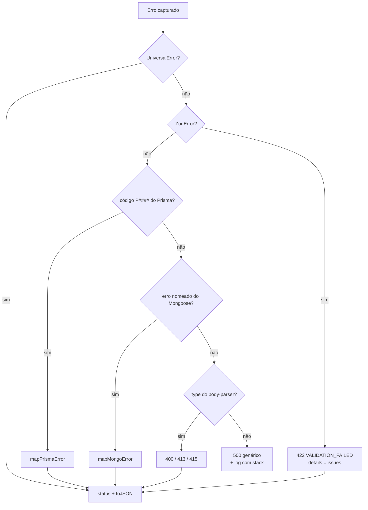

# Convenções de resposta

| Metadado            | Valor                                                        |
| ------------------- | ------------------------------------------------------------ |
| Prompt summary      | Documentar o contrato de sucesso e de erro na fronteira HTTP |
| Creation date       | 2026-09-01                                                   |
| Change count        | 1                                                            |
| Last update date    | 2026-09-26                                                   |
| Last prompt summary | Levar a paginação para a raiz do envelope                    |

Fonte de verdade: [`src/shared/types/response.ts`](../src/shared/types/response.ts), [`src/shared/infra/https/sendResponse.ts`](../src/shared/infra/https/sendResponse.ts), [`src/shared/errors/UniversalError.ts`](../src/shared/errors/UniversalError.ts) e [`src/shared/infra/https/middlewares/errorMiddleware.ts`](../src/shared/infra/https/middlewares/errorMiddleware.ts).

## Sucesso

Service chamado por controller devolve o envelope, não o dado puro:

```ts
export interface IPaginationMeta {
  page: number;
  limit: number;
  total: number;
  totalPages: number;
  hasNext: boolean;
}

/** Campos de paginação ficam na raiz do envelope, ao lado de `data`, não aninhados. */
export interface IResponseEx<T = unknown> extends Partial<IPaginationMeta> {
  success: boolean;
  status: number;
  message?: string;
  data?: T;
  /** Headers extras a setar na resposta — o `sendResponse` aplica. */
  headers?: Record<string, string>;
}
```

O `sendResponse` fragmenta isso nas camadas certas do HTTP: `status` vai para a linha de status e **não** se repete no corpo; `headers` é aplicado na resposta; o corpo sai como o resto do envelope — `{ success, message, data }` e, em listagem, os campos de paginação na raiz.

```ts
public async create(req: Request, res: Response): Promise<Response> {
  const service = container.resolve(CreateService);
  const result = await service.execute(req.body as IUser);
  return sendResponse(res, result);
}
```

### Criação

```jsonc
// HTTP 201
{
  "success": true,
  "message": "Usuário criado com sucesso!",
  "data": { "id": "9f1c...", "name": "Arthur", "email": "arthur@exemplo.com", "isAdmin": false },
}
```

### Listagem

Os campos de paginação só aparecem em resposta paginada, na raiz, e vêm do repositório — o service não calcula página. `hasNext` é `page < totalPages`; coleção vazia dá `totalPages: 0` e `hasNext: false`.

```jsonc
// HTTP 200 — GET /api/users?page=2&limit=20&search=arthur
{
  "success": true,
  "data": [/* ... */],
  "page": 2,
  "limit": 20,
  "total": 47,
  "totalPages": 3,
  "hasNext": true,
}
```

### Sem conteúdo

`204` e `304` não podem ter corpo; o `sendResponse` encerra a resposta sem serializar. O service devolve `{ success: true, status: 204 }` e nada mais.

## Erro

Erro é **lançado**, nunca retornado como `success: false` a partir do service:

```ts
throw new ConflictError({ message: 'Já existe um usuário cadastrado com esse email.' });
throw new NotFoundError('Usuário não encontrado.'); // string vira `message`
```

`UniversalError` aceita string curta ou o objeto completo:

| Campo           | Uso                                                                     |
| --------------- | ----------------------------------------------------------------------- |
| `title`         | Título por status; preenchido automaticamente se omitido.               |
| `message`       | Mensagem ao usuário final, em português.                                |
| `status`        | Definido pela subclasse.                                                |
| `code`          | Código estável para o cliente ramificar (`VALIDATION_FAILED`, `P2002`). |
| `details`       | Detalhamento estruturado — é onde vão os issues do Zod.                 |
| `data`          | Payload extra que o cliente precise.                                    |
| `operation`     | Complementa a mensagem padrão por status.                               |
| `originalError` | Erro de origem; **não** é serializado na resposta.                      |

### Subclasses

| Classe                      | Status |
| --------------------------- | ------ |
| `BadRequestError`           | 400    |
| `UnauthorizedError`         | 401    |
| `ForbiddenError`            | 403    |
| `NotFoundError`             | 404    |
| `ConflictError`             | 409    |
| `GoneError`                 | 410    |
| `PayloadTooLargeError`      | 413    |
| `UnsupportedMediaTypeError` | 415    |
| `UnprocessableEntityError`  | 422    |
| `TooManyRequestsError`      | 429    |
| `InternalServerError`       | 500    |

### Corpo do erro

```jsonc
// HTTP 409
{
  "success": false,
  "name": "ConflictError",
  "title": "Conflito de dados!",
  "message": "Já existe um usuário cadastrado com esse email.",
}
```

```jsonc
// HTTP 422 — falha de schema Zod
{
  "success": false,
  "name": "UnprocessableEntityError",
  "title": "Erro de validação!",
  "message": "Erro de validação dos dados fornecidos.",
  "code": "VALIDATION_FAILED",
  "details": [
    { "path": "email", "message": "Email deve ser válido" },
    { "path": "password", "message": "Senha deve ter no mínimo 8 caracteres" },
  ],
}
```

## O que o errorMiddleware traduz



Fora de produção o 500 genérico inclui `error` com a mensagem original; em produção não.

### Tradução do Prisma

| Código  | Vira                                             |
| ------- | ------------------------------------------------ |
| `P2002` | 409 — já existe registro com o mesmo campo único |
| `P2003` | 422 — referência inválida                        |
| `P2011` | 422 — campo não pode ser nulo                    |
| `P2014` | 409 — violaria relação obrigatória               |
| `P2025` | 404 — registro não encontrado                    |
| outros  | 400 genérico, com o código no campo `code`       |

`P2025` em `update`/`delete` é tratado **antes** disso: a base devolve `null`, e o service decide se isso é `NotFoundError` ou um caminho válido.

### Tradução do Mongo

| Origem                    | Vira                              |
| ------------------------- | --------------------------------- |
| `code: 11000`             | 409 — violação de índice único    |
| `CastError`               | 400 — valor inválido para o campo |
| `ValidationError`         | 422 — com `details` por campo     |
| demais nomes reconhecidos | 400 genérico                      |

## O que não existe hoje

- Não há tradução de erro de `jsonwebtoken` no middleware: o `verifyToken` já converte qualquer falha em `UnauthorizedError`.
- Não há `code` padronizado para os erros de negócio lançados pelos services — só os que vêm do Zod e dos bancos preenchem o campo.
- Não há spec OpenAPI neste repositório.
